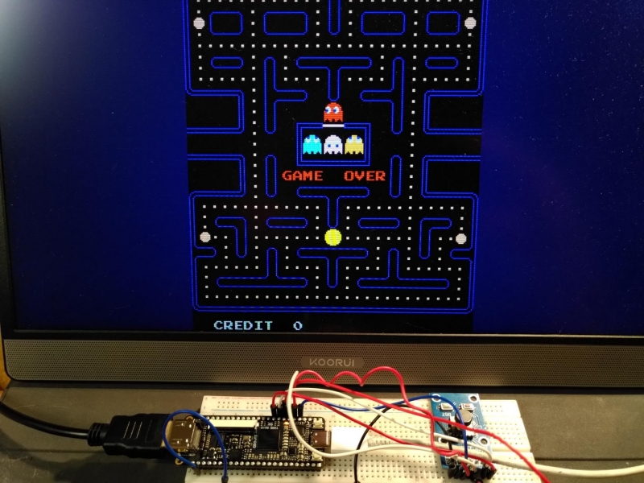
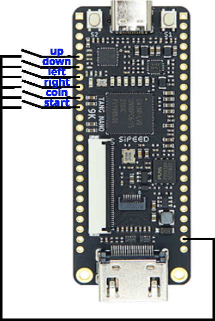

# Pac-Man on TangNano9k

A Pac-Man Arcade implementation for the TangNano9K using HDMI for
video and audio output.



## Why another Pac-Man in HDL?

There are many Pac-Man implementations in HDL, especially the [great
version by MikeJ](https://www.fpgaarcade.com/kb/pacman/).  I wanted to
gain some experiences with the GoWin FPGAs and wanted to make use of
the HDMI output of the TangNano9K. So I wrote another Pac-Man.

Most existing versions recreate the original video and in a way that
outputs an upright 60hz signal with NTSC timing expecting the screen
to be mounted in portrait mode as it was in the original Arcade
machine. Such a signal can be converted to HDMI in landscape
format. But that needs a seperate frame buffer.

I wanted to implement the video to directly output a signal compatible
with modern screens. So the video logic implemented here does not work
like the original arcade machine. Instead it replaces the video logic
by something that outputs a double scanned signal with 576 lines
(576p@60hz).

By default the video is 1024x576p to nicely fit a 16:9 screen. The
game area is displayed centered with a dark blue border left and right.
The video can be configured to output a 4:3 video with a resolution
of 768x576p instead by commenting [this line](https://github.com/harbaum/Pacman-TangNano9k/blob/ffd44de5259a00c62c5a04174b707afd308611b1/src/top.sv#L4).

## ROMs

Since this project implements the hardware of the Pac-Man Arcade
machine it needs the original ROM files to run. These can
be obtained from the
[Pac-Man (Midway)](https://www.bing.com/search?q=pacman+midway+arcade+rom) romset.

The ROMs need to be converted into HDL source files compatible with
the GoWin toolchain. This can either be done manually using the GoWin
IDE or via the [Python conversion tool](src/roms/bin2v.py) and [a
shell script](src/roms/conv.sh).

|     ROM file    |     Contents    |   Verilog file    |     Module     | Depth | Width |
|-----------------|-----------------|-------------------|----------------|------:|------:|
| ```pacman.6e``` |   CPU ROM #1    | ```pacman_6e.v``` | pacman_6e      | 4096  |     8 |
| ```pacman.6f``` |   CPU ROM #2    | ```pacman_6f.v``` | pacman_6f      | 4096  |     8 |
| ```pacman.6h``` |   CPU ROM #3    | ```pacman_6h.v``` | pacman_6h      | 4096  |     8 |
| ```pacman.6j``` |   CPU ROM #4    | ```pacman_6j.v``` | pacman_6j      | 4096  |     8 |
| ```pacman.5e``` |   tile graphics | ```pacman_5e.v``` | pacman_5e      | 4096  |     8 |
| ```pacman.5f``` | sprite graphics | ```pacman_5f.v``` | pacman_5f      | 4096  |     8 |
| ```82s123.7f``` |   color palette | ```82s123_7f.v``` | prom_82s123_7f |    32 |     8 |
| ```82s126.4a``` |        colormap | ```82s126_4a.v``` | prom_82s126_4a |   256 |     4 |
| ```82s126.1m``` | audio wavetable | ```82s126_1m.v``` | prom_82s126_1m |   256 |     4 |
| ```82s126.3m``` | audio wavetable | ```82s126_3m.v``` | prom_82s126_3m |   256 |     4 |

The easiest way to convert these files is to place the ten ROM files
in the [src/roms](src/roms) directory and then run the
[shell script](src/roms/conv.sh).

## Usage

Convert the ROMs as described above.

Open the [project file](https://github.com/harbaum/Pacman-TangNano9k/blob/main/pacman.gprj) in
the GoWin IDE and make sure you have "System Verilog 2017" selected in
```Project/Configuraion/Synthesize/General```.

Rinally run the synthesis and download the resulting bitstream onto the TangNano9K.

## Buttons

Once the game runs it can be controlled with six buttons connected to the TangNano9K
as depicted below:


