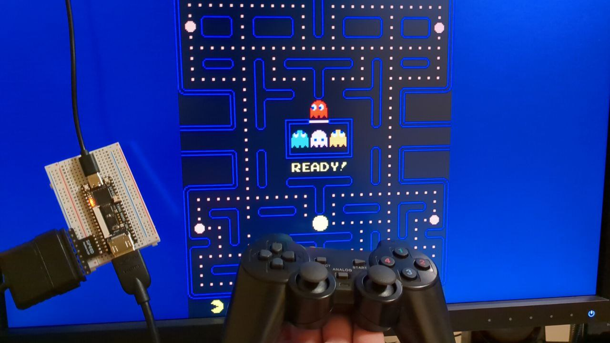

# Pac-Man on TangNano20k

A Pac-Man Arcade implementation for the [TangNano20K](https://wiki.sipeed.com/hardware/en/tang/tang-nano-20k/nano-20k.html) using HDMI for video and audio output. 

## PSX joystick

Once the game runs it can be controlled with a PSX dualshock controller connected to the TangNano20K on port 1.

Select for Coin

Start to Play

## Buttons

Relative location of pin buttons is the same as in tangnano9k except for the GND common pin that should be connected to an spare GND pin. See [pins used](tangnano20k/src/pacman.cst).
