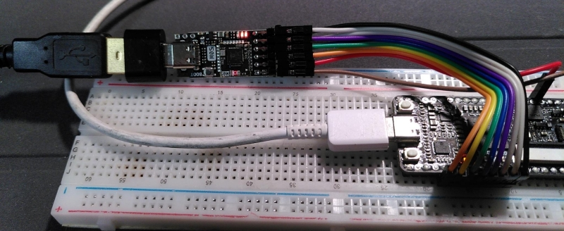

# m0s dock USB host joystick

This firmware for the
[m0s dock](https://wiki.sipeed.com/hardware/en/maixzero/m0s/m0s.html)
allows to use a USB joystick in a setup expecting digital direction
signals (UP, DOWN, LEFT, RIGHT, FIRE, ...).



Currently report descriptors are not parsed. This means that only
those joysticks will work that use a certain message format on the
USB. One joystick known to work is the [COMPETITION PRO USB](https://www.speedlink.com/en/COMPETITION-PRO-EXTRA-USB-Joystick-black-red/SL-650212-BKRD).

## Video

- [Youtube video with COMPETITION PRO USB](https://www.youtube.com/shorts/Z1DRsI0xd8o)

## Compile

Compilation has only been tested under Linux.

Download the Bouffalo toolchain:

```
git clone https://gitee.com/bouffalolab/toolchain_gcc_t-head_linux.git
```

And the Bouffalo SDK:

```
git clone https://github.com/bouffalolab/bouffalo_sdk.git
```

Compile the firmware:

```
$ CROSS_COMPILE=<where you downloaded the toolchain>/bin/riscv64-unknown-elf- BL_SDK_BASE=<where you downloaded the sdk>/bouffalo_sdk/ make
```

The resulting binary can be flashed onto the M0S. You need to unplug
the M0S from USB, press the BOOT button and plug it into USB with the
BOOT button pressed. Once connected release the BOOT button. The device
should now show up with its bootloader on the PC:

```
$ lsusb
...
Bus 002 Device 009: ID 349b:6160 Bouffalo Bouffalo CDC DEMO
...
```

Also an ACM port should have been created for this device as e.g.
reported in the kernel logs visible with ```dmesg```:

```
usb 2-1.7.3.3: new high-speed USB device number 9 using ehci-pci
usb 2-1.7.3.3: config 1 interface 0 altsetting 0 endpoint 0x83 has an invalid bInterval 0, changing to 7
usb 2-1.7.3.3: New USB device found, idVendor=349b, idProduct=6160, bcdDevice= 2.00
usb 2-1.7.3.3: New USB device strings: Mfr=1, Product=2, SerialNumber=0
usb 2-1.7.3.3: Product: Bouffalo CDC DEMO
usb 2-1.7.3.3: Manufacturer: Bouffalo
cdc_acm 2-1.7.3.3:1.0: ttyACM3: USB ACM device
```

Once it shows up that way it can be flashed:

```
BL_SDK_BASE=<where you downloaded the sdk>/bouffalo_sdk/ make CHIP=bl616 COMX=/dev/ttyACM3 flash
```

## Usage

The joystick can be connected to the USB-C port of the M0S dock using a
USB-A to USB-C adaptor. Since the joystick will not provide power
to the M0S dock it now needs to be supplied from the 5V and GND
pins on the extension connector.

The M0S dock has three LEDs. The rightmost indicates that power
is available. This one needs to light up once 5V is applied to the
extension connector.

The middle LED is used to indicate that a HID device has been
detected. This means that the M0S has detected an input device (joystick,
keyboard or mouse) on the USB port.

And the third leftmost LED mirrors the state of the first fire button.
If a matching joystick is connected this LED should be controllable by
one of the joysticks fire buttons. If it isn't, then the joystick is not
compatible.

If the fire LED works, then the active-low digital signals should be
available on the extension connector:

| Function |   Pin   |
|----------|--------:|
| Up       |   IO10  |
| Down     |   IO11  |
| Left     |   IO12  |
| Right    |   IO13  |
| Button 1 |   IO14  |
| Button 2 |   IO15  |
| Button 3 |   IO16  |
| Button 4 |   IO17  |


